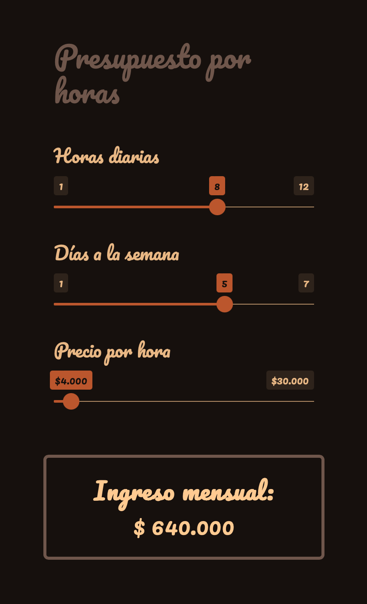

# Estimador de ingresos de trabajo por horas

[App web](https://bastianoleah.shinyapps.io/estimador_ingresos_trabajo/) que permite hacer un presupuesto básico para un trabajo cobrado por horas, definiendo las horas diarias de trabajo, los días a la semana que vas a trabajar, y el precio por hora que vas a cobrar.

[Disponible gratis aquí](https://bastianoleah.shinyapps.io/estimador_ingresos_trabajo/)

Aplicación desarrollada en R sólo en 98 líneas de código. Depende de los paquetes `{shiny}` para aplicaciones web interactivas, `{htmltools}` para simplificar el uso de estilos CSS, `{bslib}` para aplicar temas de colores a aplicaciones Bootstrap, y `{shades}` para modificar paletas de colores de forma programática.

